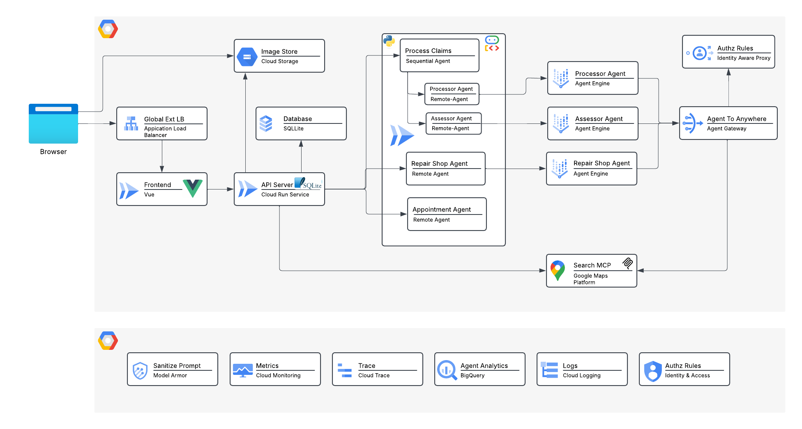

# Auto Claims Application

[](https://github.com/srinandan/auto-claims-demo/actions/workflows/ci.yaml)
[](./LICENSE.txt)
[](./backend/go.mod)
[](./ai-service/pyproject.toml)
[](./frontend/package.json)
[](https://github.com/srinandan/auto-claims-demo/actions/workflows/codeql.yml)



This project is an **Auto Claims Processing Application** that streamlines the claims process by allowing users to submit claims and automatically analyzing vehicle images for damage using an AI service.

The system consists of several microservices:

1.  **[Frontend](./frontend/README.md)**: A responsive web interface built with **Vue 3**, **Vite**, and **Tailwind CSS v4**.
2.  **[Backend](./backend/README.md)**: A robust REST API built with **Go (Gin)** and **SQLite**.
3.  **[AI Service](./ai-service/README.md)**: A specialized service built with **Python (FastAPI)** that uses **Vertex AI** and **YOLOv11** to analyze images and orchestrate the claims process.
4.  **[Assessor Agent](./assessor-agent/README.md)**: A remote A2A agent that assesses damage severity based on AI analysis.
5.  **[Processor Agent](./processor-agent/README.md)**: A remote A2A agent that generates repair estimates and makes final claim decisions.
6.  **[Repair Shop Agent](./repair-shop-agent/README.md)**: A remote A2A agent that handles communication with repair shops to book appointments.
7.  **[Load Generator](./loadgen/README.md)**: A synthetic API load generation tool built with **Node.js** that injects realistic traffic patterns into the backend for OpenTelemetry analytics.

## Prerequisites

Ensure you have the following installed:

*   [Node.js](https://nodejs.org/) (v18+)
*   [Go](https://go.dev/) (v1.23+)
*   [Python](https://www.python.org/) (v3.10+) and [uv](https://docs.astral.sh/uv/)
*   [Google Cloud SDK](https://cloud.google.com/sdk/docs/install) (`gcloud`)

## Quick Start

Detailed instructions for each service are available in their respective directories, but here is a quick summary to get everything running locally.

### 1. Start the Agents

In separate terminals:
```bash
# Terminal 1: Assessor Agent
cd assessor-agent
make local-assessor-agent
# Runs on http://localhost:8081

# Terminal 2: Processor Agent
cd processor-agent
make local-processor-agent
# Runs on http://localhost:8082

# Terminal 3: Repair Shop Agent
cd repair-shop-agent
make local-repair-shop-agent
# Runs on http://localhost:8083
```

### 2. Start the AI Service
```bash
cd ai-service
make local-ai-service
# Runs on http://localhost:8000
```

### 3. Start the Backend
```bash
cd backend
make local-backend
# Runs on http://localhost:8080
```

### 4. Start the Frontend
```bash
cd frontend
make local-frontend
# Runs on http://localhost:5173
```

### 5. Start the Load Generator (Optional)
If you want to generate synthetic traffic to your APIs:
```bash
cd loadgen
make local-loadgen
# Begins generating traffic immediately
```

## Cloud Deployment

Deploying this application to Google Cloud is split into three distinct phases to ensure a clean user experience:

### Phase 1: Foundation Setup
First, provision the core infrastructure (APIs, Service Accounts, GCS Buckets, Artifact Registry, BigQuery, and Secret Manager) by running the foundation script.
```bash
python3 infra/setup.py
```

### Phase 2: Deploy Services
Next, you must build and deploy each of the microservices to Cloud Run and Vertex AI Reasoning Engine. Navigate to each directory and run the deployment process (e.g., using Cloud Build):
```bash
# Example for backend
cd backend
gcloud builds submit --config .cloudbuild/deploy.yaml .
# Repeat for frontend, ai-service, assessor-agent, processor-agent, and repair-shop-agent.
```

### Phase 3: Setup Load Balancer
Once all services are deployed natively, execute the load balancer script to tie the frontend and backend together under a single Global Application Load Balancer with a managed SSL certificate.
```bash
python3 infra/setup_lb.py
```

## Contributing

Please see [CONTRIBUTING.md](./CONTRIBUTING.md) for details on how to contribute to this project.

## Support

This demo is *NOT* endorsed by Google or Google Cloud. The repo is intended for educational/hobbyists use only.

## License

This project is licensed under the terms of the [LICENSE.txt](./LICENSE.txt) file. The AI generated car damage pictures are licensed under the Creative Commons Attribution 4.0 International License. To view a copy of this license, visit <http://creativecommons.org/licenses/by/4.0/>
